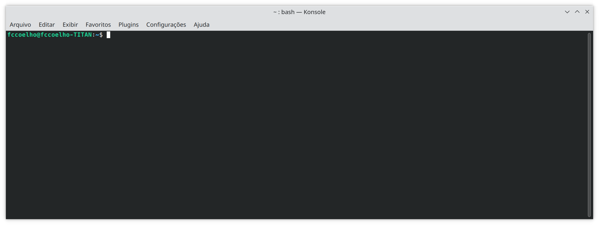
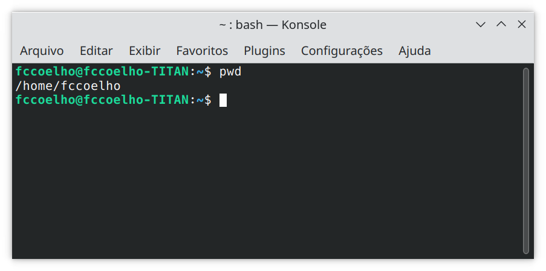
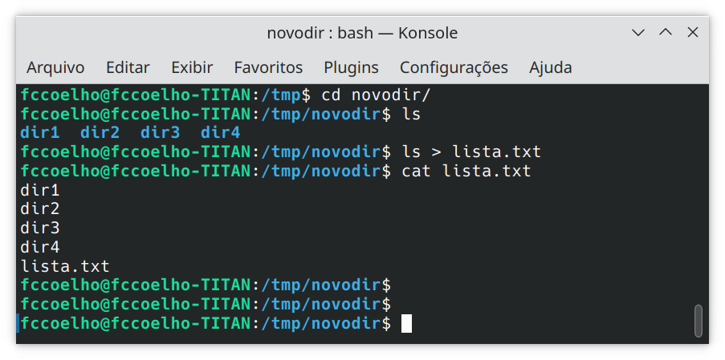
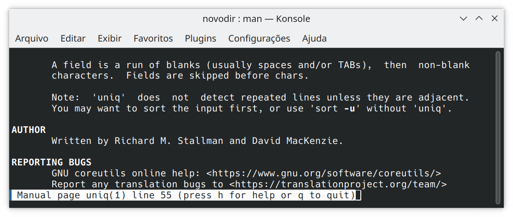

# O Shell do Linux
O Shell (casca, em inglês), é o mais próximo que conseguimos chegar de manipular o SO. É uma interface textual para controle do seu computador.

A comunicação por text na era digital domina todas as outras formas de comunicação, pensem em quantas mensagens de texto uma pessoa média envia e recebe por dia. Por quê então tão poucas pessoas se comunicam com os seus computadores por mensagens de texto?

A resposta mais direta a esta pergunta pode ser: "porquê não sabe a lingua do computador". E isto é verdade. Por isso iremos aprender nesta aula a como nos comunicar por texto com o computador.

Uma outra razão para não nos comunicarmos mais por texto é a Insistência dos designers de interface para que utilizemos interfaces gráficas. Mas veremos que para muitas tarefas a interface de texto pode ser muito mais eficiente.

O shell do Linux, também chado de *terminal* ou *console*, consiste basicaent de uma linha em branco na qual podemos digitar nomes de aplicativos, usar comandos do SO (também intermediados por aplicativos), e construir peuenos trechos de código na linguagem Shell para executa tarefas mais complexas para as quais precisariamos combinar as capacidades de vários aplicativos.

## Abrindo um terminal ou console
No Linux para ter acesso ao terminal, basta procurar no menu de aplicativos pela palavra `terminal` ou `console`. Geralmente esta busca trará mais de uma alternativa de aplicativos de terminal.

Escolha um e execute. Se você está acompanhando esta aula de uma máquina com Windows, simplesmente abra o GitBash ele é uma shell do Linux quase completa. Geralmente o atalho de teclado `ctrl-alt-t` abrirá o terminal padrão. Sim, usuários de terminal preferem sempre usar o teclado do que o mouse!

A primeira coisa que chamará a sua atenção é o chamado **prompt** qe será parecido com o da figura abaixo:


O terminal parece saber qual o seu nome de usuário e o nome do seu computador. Isto nos informa que cada sessão do terminal está associada a um usuário e pode estar conectada a outro computador, caso contrário não precisaria informar o nome do computador.

O console tipicamente se inicial na pasta do usuário denotada por `~`, no prompt. A qualquer momento você podesaber em que diretório (o mesmo que pasta) você está, usando o comando `pwd`(print working directory).


Tudo que escrevemos no terminal do Linux é sensível à capitalização, ou seja, o comando "Pwd" ou "PWD" não existe.

O console está sempre localizado em um diretório da árvore do sistema de arquivos. Daí a importância de sabermos qual o "diretório de trabalho" atual. A qualquer momento  podemos retornar à pasta do usuário digitando `cd ~` ou apenas `cd`.

O sistema de arquivos do Linux consiste em uma árvore de diretórios  com uma única raiz. Experimente os seguintes comando:
```bash
$ cd /
$ pwd
```

Caso vc queira visualizar esta árvore, ou o ramo que começa no diretório em que você está, pode usar o seguinte comando:

```bash
$ tree
```

A esta altura você já percebeu que o comando `cd` significa "change directory". Se você executou o comando `cd /` acima, pode agora digitar os seguintes comandos:

```bash
$ cd home
$ pwd
```

**Quiz:**

    Se você estiver em seu diretório, `/home/<username>` como você pode mudar para o diretório `home` com um só comando?

Para saber o nome do usuário local (no caso de não aparecer no seu prompt), você pode usar o comando `whoami`.

## Criando diretórios

Outra tarefa muito fácil de se realizar no terminal é criar diretórios:

```bash
$ mkdir /tmp/novodir
$ cd /tmp/novodir
```

Note que aqui utilizamos um caminho "absoluto", ou seja que começa da raiz do arquivo.

 Você pode criar múltiplos diretórios de uma vez, caso queira:

 ```bash
 $ mkdir dir1 dir2 dir3
 ```

 Ou podemos criar um ramo de diretórios de uma só vez:

 ```
 $ mkdir -p dir4/dir5/dir6
 $ tree
 ```

Ao manipular diretórios podemos usar alguns atalhos para evitar ter de escrever os nomes dos diretórios. Por exemplo, `.` representa o diretório atual. O diretório acima do atual, é denotado por `..`. 

**Quiz:**

    Vá para o diretório `dir6` criado anteriormente (usando `cd`), e volte para o diretório `/tmp/novodir` apenas usando atalhos.

## Criando Arquivos

Outra tarefa comum realizada no terminal é a manipulação de arquivos. Por exemplo podemos criar um arquivo com a listagem do conteúdo do diretório corrente:


O que fizemos acima foi apenas redirecionar a saída do comando `ls`para o arquivo `lista.txt`. Em seguida usamos o comando `cat` para mostrar na tela o conteúdo do arquivo.

**Quiz:**

    Duplique o conteúdo de lista.txt, em um outro arquivo chamado 'duplicado.txt' com um único comando.

A resposta do quiz acima é:
```bash
$ cat lista.txt lista.txt > duplicado.txt
```
o operador `>` cria um novo arquivo, ou caso já exista um de mesmo nome, o sobrescreve.

Para adicionar mais conteúdo a um arquivo, podemos usar um outro operador:

```bash
$ echo "primeira linha" > multi.txt
$ echo "segunda linha" >> multi.txt
$ echo "terceira linha" >> multi.txt
```
Use `cat` para verificar o conteúdo de `multi.txt` após a execução dos comandos acima. 

## Movendo e manipulando arquivos

Mover arquivos de um ponto a outro na árvore de diretórios pode ser feito com o comando `mv`

```bash
$ mv duplicado.txt dir1/
$ ls dir1
```
O comando acima move o arquivo `duplicado.txt` para o diretório `dir1`. Para desfazer o movimento, uma possibilidade é

**Quiz**

    Mova o arquivo `duplicado.txt` de volta para o diretório corrente.

O comando `mv` aceita mais de um argumento então se passarmos mais de um nome a ele o último será interpretado como o destino.

```bash
$ mv dir1 multi.txt dir4/dir5/dir6
$ ls dir4/dir5/dir6
$ tree
```
O comando `mv` move arquivos e diretórios. Caso queiramos apenas copiar, ou seja, criar uma cópia de um arquivo sem apagar a versão original, temos que usar o comando `cp`.

```bash
$ cp dir4/dir5/dir6/dir1/duplicado.txt .
$ ls dir4/dir5/dir6/dir1
$ ls
```
O comando  `cp` permite renomear a copia que estamos fazendo.

```bash
$ cp duplicado.txt duplicado_copia.txt
$ ls
```
## Apagando Arquivos e diretórios

Para apagar arquivos usamos o comando `rm`.

**Este comando é muito perigoso pois não há como recuperar arquivos que foram apagados**

```bash
$ rm duplicado_copia.txt
$ ls
```
O comando `rm`só apaga arquivos e não diretórios. Para apagar diretórios vc precisa do comando `rmdir` mais ele só apaga diretórios vazio. Para apagar uma ramo inteiro:

```bash
$ rm -r dir4
$ ls
```

## Conectando comandos: introdução aos pipes.

Suponha que você deseja saber quantos arquivos existem no seu diretório home. O comando `wc` (word count) faz a contagem:

```bash
$ wc -l multi.txt
```
usando a opção `-l` o `wc` nos retorna a contagem de linhas.

Então poderíamos resolver nossa tarefa com três comandos:

```
ls ~ > file_list.txt
wc -l file_list.txt
rm file_list.txt
```
Este método funciona mas requer a criação de uma arquivo temporário para conter o conteudo do diretório, que tem que ser deletado após a contagem.

Para simplificar esta solução precisamos saber que todos os processos no Linux possuem entradas e saídas padrão. Elas são chamadas de STDIN e STDOUT, respectivamente. Então torna-se possível conetar a saída de um programa com a entrada de outro através de tubo ou "pipes" no jargão do Linux.

```bash
$ ls ~ | wc -l
```

O tubo é representado pelo caracter `|`, e desta forma não há necessidade de criar uma arquivo temporário.

Podemos utilizar o pipe para quanquer tarefa, por exemplo apenas para visualizar texto, por exemplo:

```bash
$ ls /etc | less
```
Pressione a tecla *q* para sair do less.

Podemos usar multiplos pipes também

```bash
cat duplicado.txt | uniq | wc -l
```

este "pipeline" conta quantas linhas distintas existem em duplicado. Curiosamente o resultado obtido está errado! Para sabermos o porquê precisamos consulta o manual de `uniq`

```bash
$ man uniq
```


Ah... então o `uniq` só detecta linhas duplicadas se elas forem adjacentes! sem problema!

```bash
$ sort duplicado.txt | uniq | wc -l
```

A esta altura você já advinhou o que faz o comando `sort`, mas se ainda estiver com dúvidas pode usar o `man` para descobrir!

Existem muitas outras pérolas no console do Unix. Seguem algumas referências abaixo.

## Referências

1. https://en.wikipedia.org/wiki/Pipeline_(Unix)
2. https://www.debian.org/doc/manuals/debian-reference/ch01.en.html
3. https://tldp.org/LDP/gs/node5.html
   


